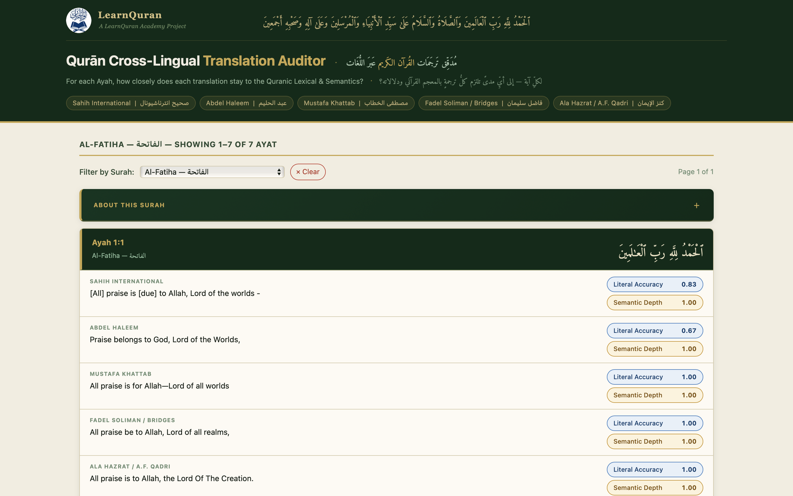
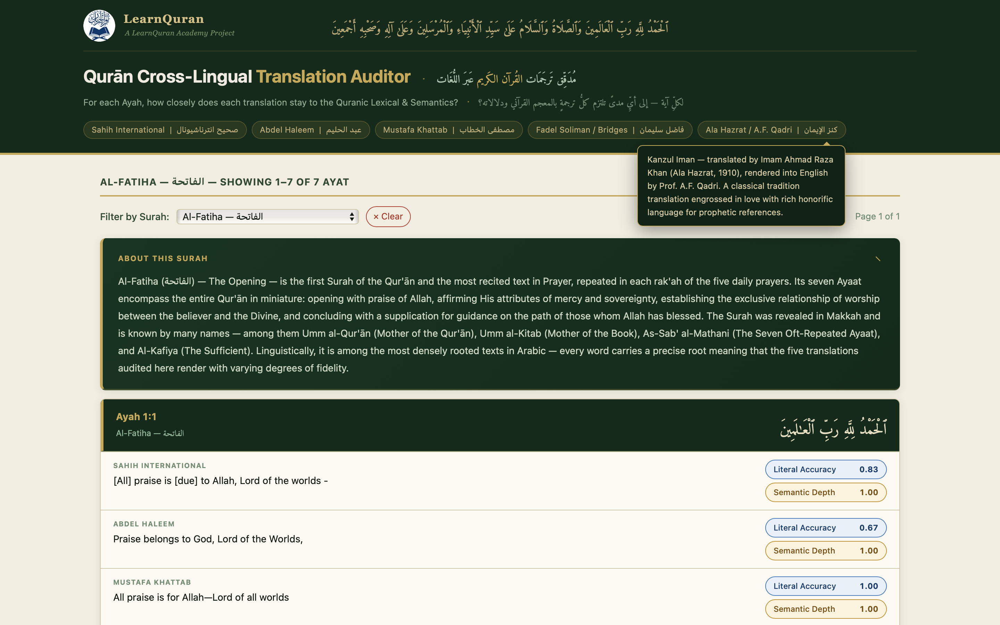
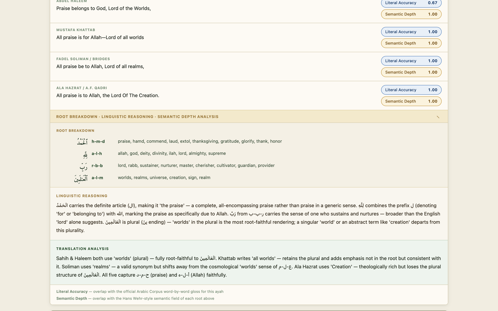
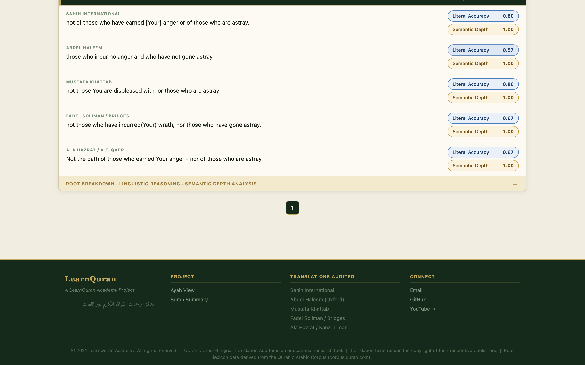

# Qurān Cross-Lingual Translation Auditor  (مدقق ترجمات القرآن الكريم عبر اللغات)

**A LearnQuran Academy Project**

A research and educational tool that algorithmically scores how faithfully five major English translations of the Quran preserve the meaning of the original Arabic — at both the word level and the root semantic level.

---

## Preview

> Dashboard showing Ayah cards with Literal Accuracy and Semantic Depth scores, Root Breakdown, Linguistic Reasoning, and Translation Analysis panels.






---

## Live Demo

Comming soon..

---

## What It Does

When scholars or students compare Quran translations, they typically rely on subjective reading. This tool makes that comparison **quantitative and systematic** — giving each translation a measurable score per Ayah across two independent dimensions.

### Two Scoring Layers

| Score | What it measures |
|---|---|
| **Literal Accuracy** | Jaccard similarity between the translation's content words and the official Quranic Arabic Corpus word-by-word English gloss |
| **Semantic Depth** | How well the translation's vocabulary covers the Hans Wehr semantic field of each Arabic root in the Ayah |

### Five Translations Audited

| Translator | Edition |
|---|---|
| Sahih International | 1997 |
| Abdel Haleem | Oxford University Press, 2004 |
| Mustafa Khattab — The Clear Quran | 2015 |
| Fadel Soliman / Bridges | 2020 |
| Ala Hazrat / A.F. Qadri — Kanzul Iman | 1912 (English rendering 2017) |

### Coverage
- **6,236 Ayat** across all 114 Surahs
- **Literal Accuracy** scores for every Ayah
- **Full Root Breakdown + Linguistic Reasoning + Semantic Depth Analysis** for Al-Fatiha (1:1–1:7)
- **Semantic Depth** scoring for Al-Fatiha using 345 hand-curated root lexicon entries
- Root data for remaining Surahs planned for future versions

---


## Project Structure

```
QURAN-TRANSLATION-AUDITOR/
│
├── run.py                          # Flask app — main entry point
├── Procfile                        # Railway/Render deployment config
├── requirements.txt                # Python dependencies
├── README.md
├── technical_report.md             # Technical documentation
├── .gitignore
│
├── src/                            # Core Python modules
│   ├── fidelity_engine.py          # Scoring engine (Layer 1 + Layer 2)
│   ├── root_lexicon.py             # 345-root Hans Wehr-style semantic lexicon
│   ├── database.py                 # DB initialisation helpers
│   └── auditor.py                  # Legacy Jaccard engine (deprecated)
│
├── app/                            # Flask app assets
│   ├── templates/
│   │   ├── index.html              # Main Ayah dashboard
│   │   └── surahs.html             # Surah summary page
│   ├── static/
│   │   ├── css/
│   │   │   ├── style.css           # Main stylesheet
│   │   │   └── surahs.css          # Surah summary page styles
│   │   └── LQ_logo.png             # LearnQuran Academy logo
│   └── __init__.py
│
├── scripts/                        # Data fetch and seed scripts
│   ├── fetch_full_quran.py         # Fetches 5 translations from quran.com
│   ├── fetch_gloss.py              # Word-by-word gloss from quran.com
│   ├── fetch_kanzuliman.py         # Scrapes Kanzul Iman from barkati.net
│   ├── fetch_roots_all.py          # Populates roots from morphology corpus
│   ├── fix_gloss_1_7.py            # Seeds missing gloss for 1:7
│   ├── fix_sahih_encoding.py       # Fixes Unicode corruption in translations
│   ├── fix_fatiha_roots_final.py   # Seeds correct Al-Fatiha roots
│   ├── seed_fatiha_roots.py        # Initial Al-Fatiha root seed
│   ├── seed_fatiha_reasoning.py    # Seeds linguistic reasoning for 1:1–1:7
│   ├── seed_fatiha_depth_commentary.py  # Seeds translation analysis for 1:1–1:7
│   ├── seed_fatiha_intro_summary.py     # Seeds surah intro for Al-Fatiha
│   ├── migrate_add_reasoning.py    # DB migration — adds reasoning column
│   ├── expand_lexicon.py           # Auto-expands root lexicon from gloss data
│   ├── rebuild_lexicon.py          # Rebuilds auto entries with better filtering
│   ├── precompute_summary.py       # Pre-computes surah-level average scores
│   ├── setup_db.py                 # Initial DB setup
│   ├── fix_fatiha_6_7.py           # Splits merged 1:6/1:7 row
│   └── check_*.py                  # Various diagnostic scripts
│
├── data/
│   ├── auditor.db                  # SQLite database — 6,236 Ayat (11MB)
│   ├── auditor.db.backup           # Backup
│   └── learnquran/
│       └── al-fatiha-draft.md      # Al-Fatiha root analysis draft
│
└── tests/
    └── test_auditor.py
```

---

## Run Locally

### Requirements
- Python 3.8+
- pip

### Setup

```bash
# 1. Clone the repo
git clone https://github.com/LearnQuranAcademy/quran-translation-auditor.git
cd quran-translation-auditor

# 2. Create and activate virtual environment
python -m venv venv
source venv/bin/activate        # Windows: venv\Scripts\activate

# 3. Install dependencies
pip install -r requirements.txt

# 4. Run the app
python run.py
```

Open `http://127.0.0.1:5000` in your browser.

The database (`data/auditor.db`) is included in the repo — no additional setup needed.

---

## Tech Stack

| Layer | Technology |
|---|---|
| Backend | Python 3, Flask |
| Database | SQLite |
| Frontend | Vanilla JS, HTML5, CSS3 |
| Fonts | Amiri Quran, Scheherazade New (Google Fonts) |
| Deployment | Railway / Gunicorn |

**No external NLP libraries** — custom tokenisation pipeline with:
- Unicode normalisation (transliteration stripping)
- Conservative suffix stemmer
- 30+ Quranic synonym equivalence groups
- Arabic prefix-aware fuzzy word matcher

---

## Data Sources

| Data | Source |
|---|---|
| Arabic text | quran.com (`text_uthmani`) |
| Word-by-word gloss | quran.com Quranic Arabic Corpus |
| Root morphology | [mustafa0x/quran-morphology](https://github.com/mustafa0x/quran-morphology) |
| Sahih, Haleem, Khattab, Soliman | quran.com translations API |
| Kanzul Iman | barkati.net |
| Root semantic lexicon | Hand-curated (345 roots) + gloss-derived (1,369 roots) |

---

## Scoring Methodology

### Layer 1 — Literal Accuracy

For each Ayah, the quran.com word-by-word English gloss is tokenised into a content-word set. Each translation is similarly tokenised. Jaccard similarity is computed:

```
score = |translation_words ∩ gloss_words| / |translation_words ∪ gloss_words|
```

Before comparison, both sets go through:
- Stopword removal (minimal — preserves Quranic function words like "not", "those", "who")
- Synonym normalisation (30+ equivalence groups: worlds/universe/realm, merciful/compassionate/gracious, etc.)
- Conservative stemming (minimum 4-char stem to prevent over-stemming)

### Layer 2 — Semantic Depth

For each Arabic root in the Ayah, the translation is checked against a Hans Wehr-style semantic field:

| Match type | Score |
|---|---|
| Core field match | 1.0 |
| Extended field match | 0.6 |
| Avoid term | -0.3 |
| No match | 0.0 |

Overall Semantic Depth = average per-root score, clamped to [0.0, 1.0].

Currently fully scored for Al-Fatiha (1:1–1:7). Planned for all Surahs in future versions.

---

## Roadmap

- [ ] Root Breakdown + Linguistic Reasoning for all 114 Surahs
- [ ] Full root lexicon expansion (1,700+ roots with verified semantic fields)
- [ ] CSV / JSON score export
- [ ] Ayah search by key (e.g. jump to 2:255)
- [ ] Surah-level summary comparison table
- [ ] Tanzil morphology alignment verification
- [ ] API endpoint for programmatic access

---

## Contributing

Pull requests welcome. Priority areas:
- Expanding `src/root_lexicon.py` with verified semantic fields for more roots
- Adding Linguistic Reasoning content for additional Surahs
- Improving synonym equivalence groups in `src/fidelity_engine.py`

---

## License

MIT License

Translation texts remain © their respective publishers and are used here solely for educational and research analysis. Root lexicon data derived from the Quranic Arabic Corpus (corpus.quran.com).

---

## Contact

📧 [Email](mailto:learnquran.iqra@gmail.com) ▶️ [YouTube](https://www.youtube.com/@LearnQuran_iqra)

---

*جزاك الله خيراً — May Allah reward you with good.*

---

**kayShahbaaz خ شهباز**